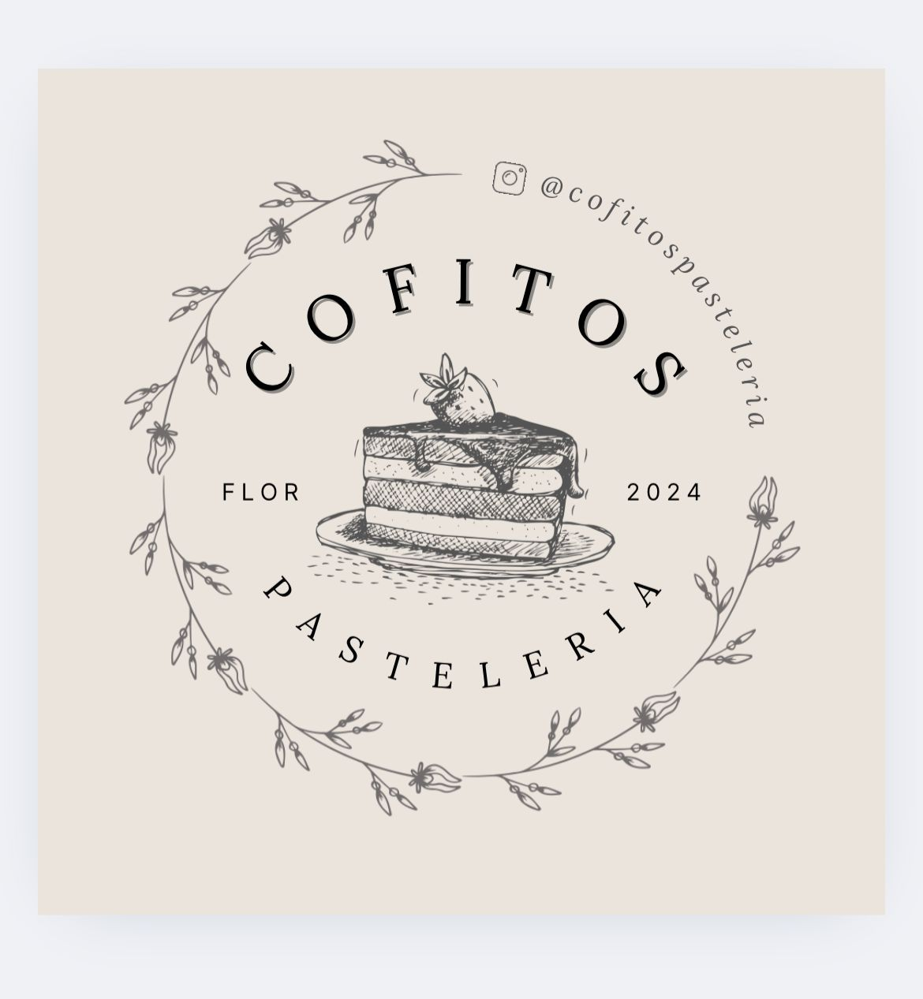

# Cofito s



## Descripción del Proyecto
Cofito s es una plataforma en línea dedicada a la venta de pasteleria de alta calidad. Nuestro objetivo es brindar a los amantes de la pasteleria una experiencia de compra única y sencilla, permitiéndoles explorar y adquirir una amplia variedad de productos.

## Dependencias
Este proyecto utiliza las siguientes dependencias:

- **Firebase**: ^11.1.0
- **sass**: ^1.81.0
- **React-dom**: ^18.3.1
- **React icons**: ^5.3.0
- **React router-dom**: ^7.0.2
- **React spinners**: ^0.15.0
- **React toastify**: ^11.0.3
- **Yup**: ^1.6.1

## Instalación
Para instalar y ejecutar este proyecto localmente, sigue estos pasos:

1. Clona el repositorio:
   ```bash
   git clone https://github.com/tu-usuario/cofito-s.git
   ```
2. Navega al directorio del proyecto:
   ```bash
   cd cofito-s
   ```
3. Instala las dependencias:
   ```bash
   npm install
   ```
4. Inicia la aplicación:
   ```bash
   npm start
   ```

## Uso
Una vez que la aplicación esté en funcionamiento, puedes navegar por el sitio para explorar y comprar diferentes tipos de café. Utiliza el carrito de compras para agregar productos y proceder al pago.

## Licencia
Este proyecto está licenciado bajo la Licencia MIT. Consulta el archivo LICENSE para más detalles.